## ML infrastructure
1. The ML code just a little bit from this picture
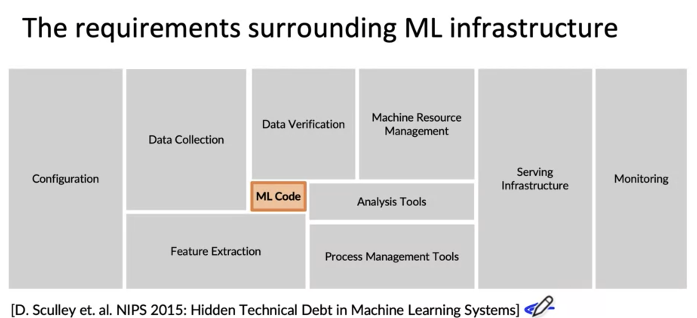
2. We have a lot of works to deploy a real production
## Steps of an ML Project:
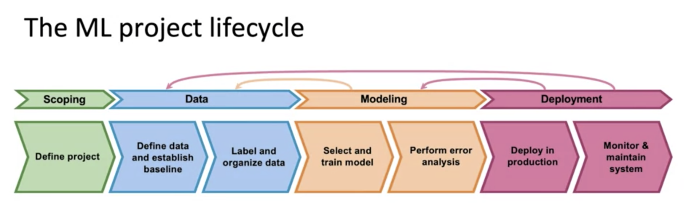
1. Define your scope
2. Collect data, label, and organzie data
3. Choose suitable model for solve problem and then analysis error, checking performance if not comeback to step 2, maybe you need more data.
4. Deploy your model to production, monitor model, check healthy and maintain the system
## Speech recognition case study:
1. Scoping Stage
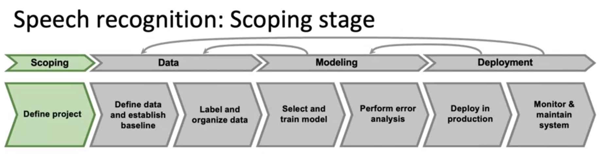
    - Decide to work on speech recognition for voice search.
    - Decide on key metrics:
        Accuracy, latency, throughput
    - Estimate resources and timeline
2. Data stage:
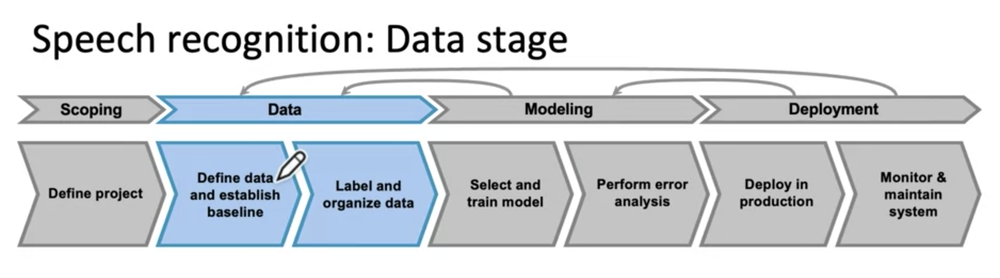
- Define data: 
    - Is the data labeled consistently?
    - How much silence before/after each clip? (100ms, 300ms, 500ms???)
    - How to perform volumne normalization?  (some speakers speak loudly, some are less loud and then there's actually a tricky  case)
3. Modeling stage: 
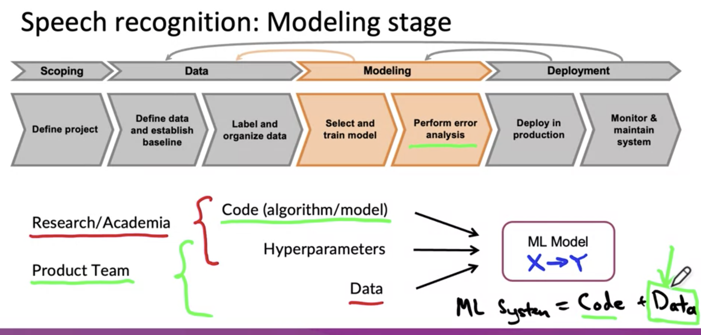
 - in reasearch and academia, a lot of research work, they tend to hold the data fixed and vary the code and hyperparameters in order to try to get good performance
- In contrast, a lot of product teams, tend to hold code fixed and to instead focus on optimizing the data and maybe the hyper parametes to get better performance.
- A machine learning system includes both codes and data and also hyper parametes. Rather than taking a model centric view of trying to optimize the code to your fixed dataset for many problems.
- During modeling, The error analysis can then tell you what is wrong. it maybe can you imporve your data, maybe improve the code too. But often if error ananlysis can tell you how to systematically improve the data, that can be a very efficient way for you to get to a high accuracy model
- And that's a trick help you don't feel like just get more data all the time because we can always use more data. Because sometimes get more data can be expensive if their analysis can help you be more targetted in excatly what data to collect.
4. Deployment stage:
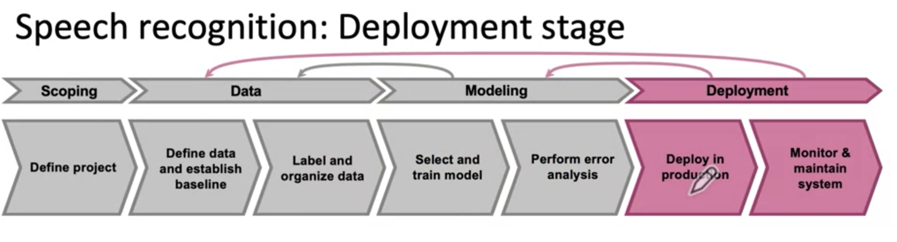
Speech recognition flow:
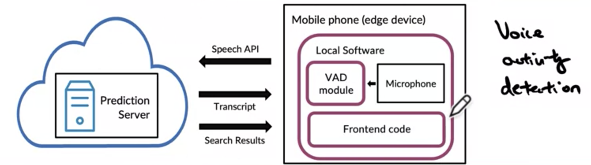
    1. Record audio from microphone and then VAD module to detect out just the audio that contains hopefully someone speaking.
    2. Send audio selected to server
    3. Prediction server predict audio and then send back both transcript and results to Mobile phone.
    4. Display results in frontend code. 
    5. Monitor and maintain the system.

One of they key challenge is concept drift or data drift, which is happens when the data distribution changes (like yound voice)

## Deployment
1. Concept drift and Data drift
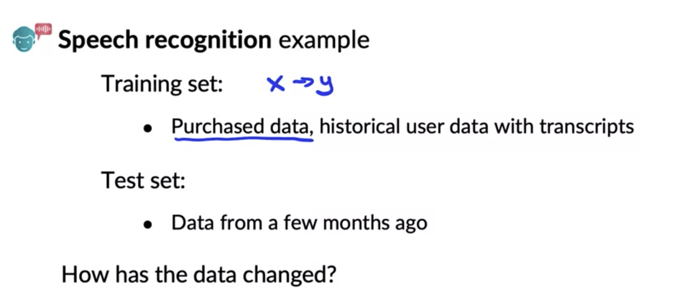
- Gradual change: new vocalbulary
- Sudden shock: covid-19, a lot of credit card fraud systems start to not work because purchase patterns individuals suddenly changed.

2. Software engineering issues
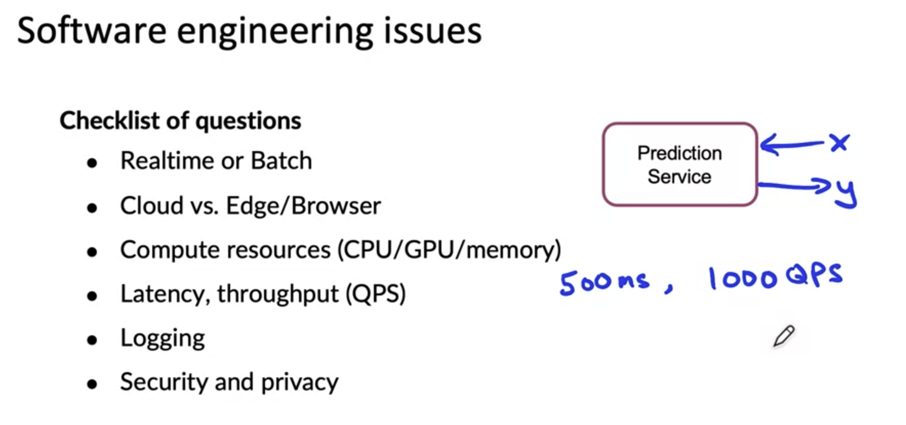
    1. Need realtime or can run overnight
    2. Choose cloud vs edge/browser
    3. Limited Resource (GPU or CPU, ram, memory, etc) we can't run the same GPU training for deployment because it's cost very high
    4. GPS (queries per second) depend on your application.
    5. Log as much of the data as possible for analysis review and mybe retrainning in the future.
    6. Depend on your dataset, example: patient dataset -> based on how sensitive that data is and also sometimes based on regulatory requirements.

3. First deployment vs. maintainance
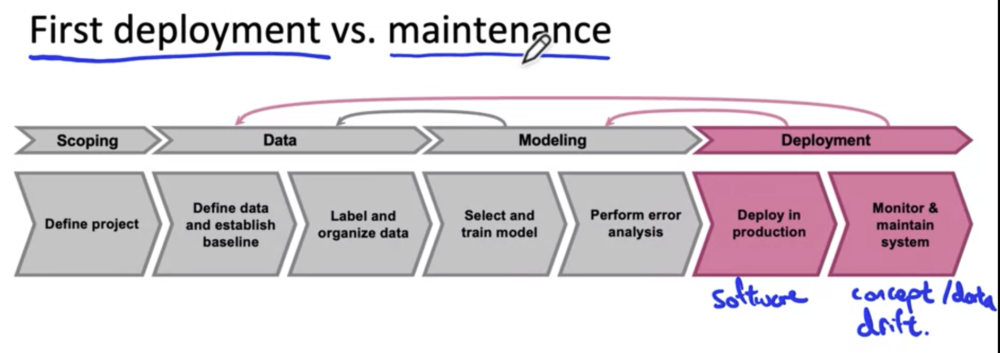
Some engineers that view deploying the machine learning model as getting to the finish line. Unfortunately, the first deployment means you may be only about haftway there, and the second half of your work is just starting only after your first deployment.

## Deployment Patterns
1. Common deployment cases
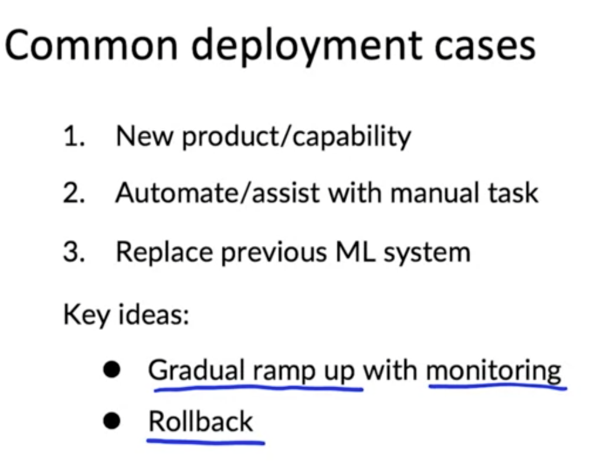
2. Canary deployment
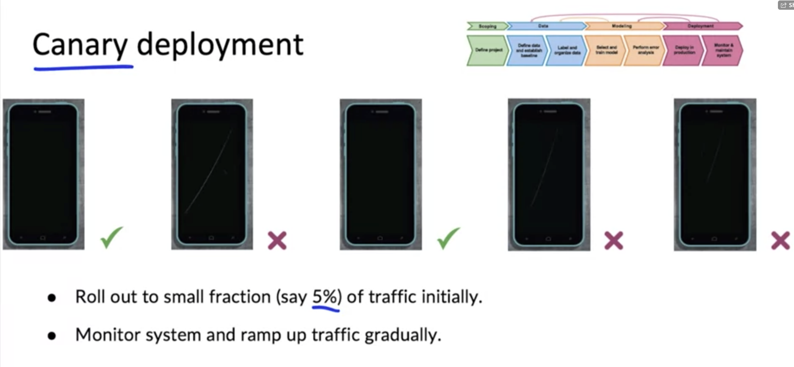
3. Blue Green deployment
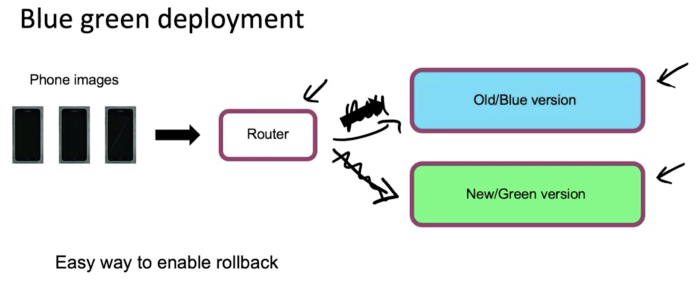
- Deployment old and new model at the same time so then we easily to rollback if anything goes wrong.
4. Degrees if automation
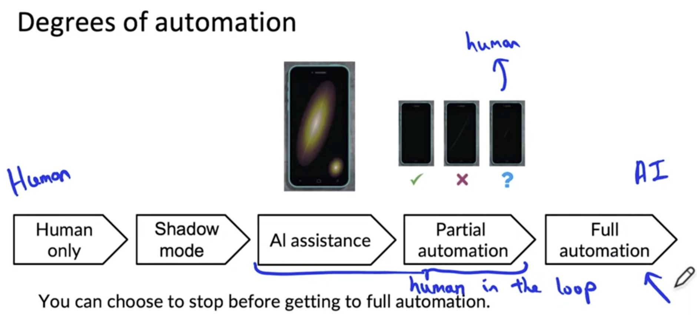
- Human only: just human making decisions.
- Shadow mode: making decisions but not actually working in factory.
- AI assitance: help human making decisions.
- Partial automation: If confidence is slow, then suggest for human making decisions.
- Full automation: AI making decisions.

## Monitor
1. Monitoring dashboard
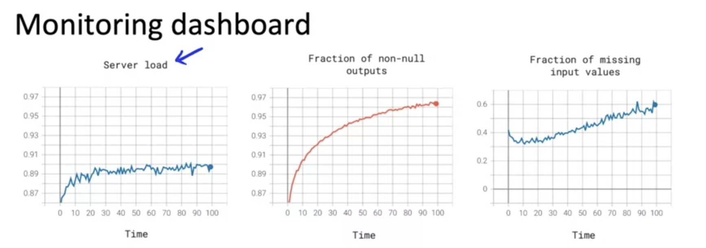
- Brainstorm the things that could go wrong.
- Brainstorm a few statics/metrics that will detect the problem
- It is ok to use many metrics initially and gradually remove the ones you find not useful.
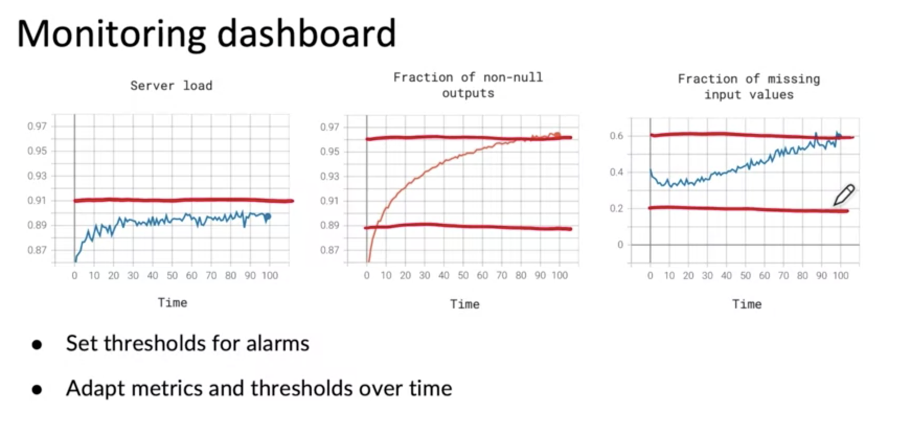
2. Examples of metrics to track
- Software metrics: Memory, compute, latency, throughput, server load.
- Input metrics: Avg input length, Avg input volume, Num missing values, Avg image brightness.
- Output metrics: # times return " "(null), # times user redoes search, # times user swtiches to typing, CTR -> help you figure out if either your leraning algorithm, output y has changed in some way, or if something that comes even after your learning algorithms output such as swithces to type
3. just as ML modeling is iterative, so is deployment
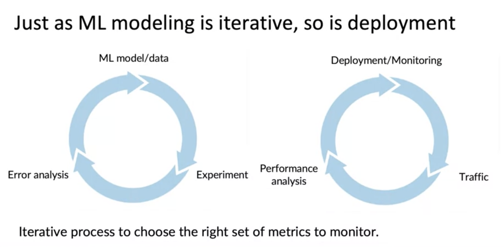

4. Model maintenance
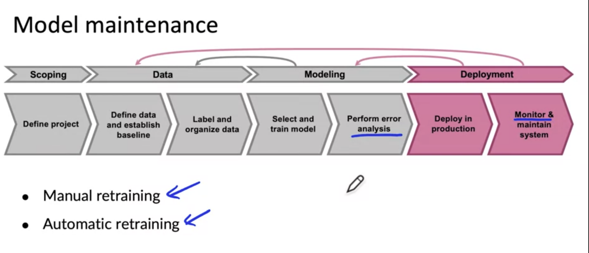

## Pipeline monitoring
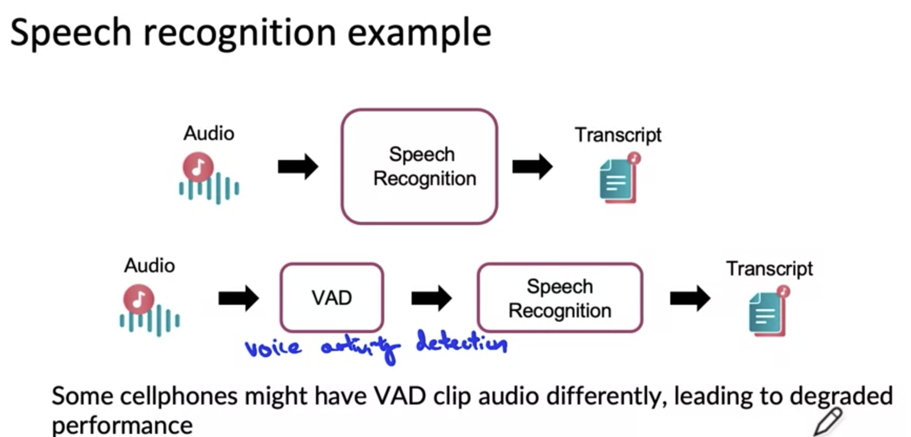
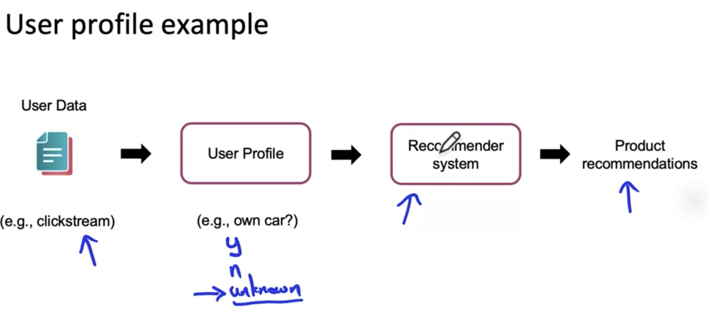
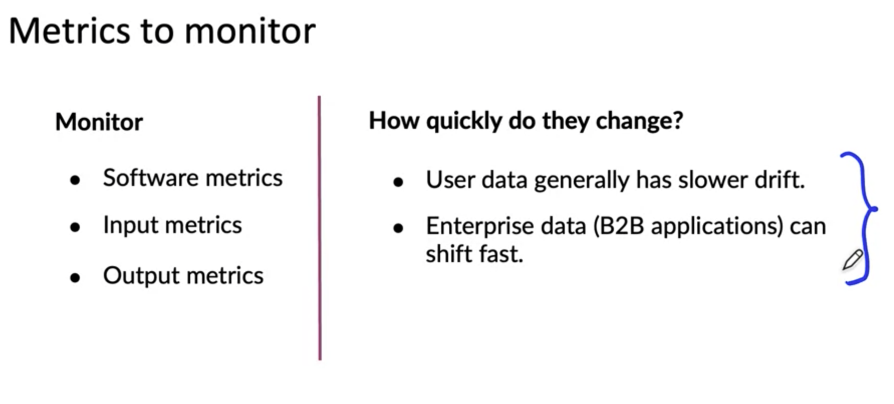

## Practice:
github: https://github.com/https-deeplearning-ai/MLEP-public/tree/main/course1/week1-ungraded-lab