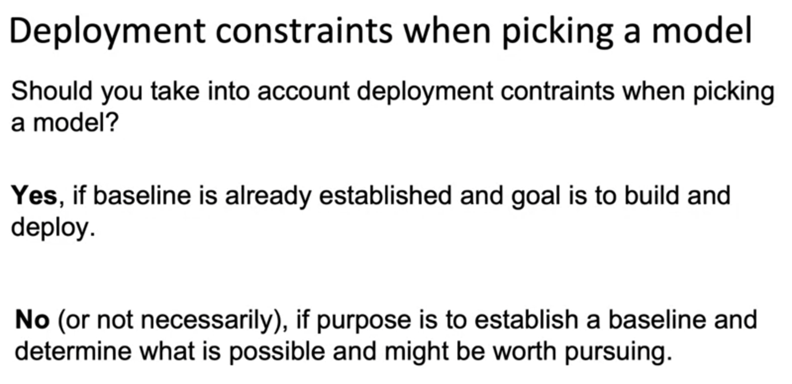
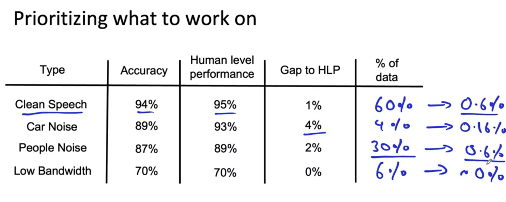

# Seletecting and Training a Model
## Key Challenges

Challenges in model development
1. Doing well on training set (usually measured by average training error).
2. Doing well on dev/test sets.
3. Doing well on business metrics/projects goals.

## Why low average error isn't good enough

## Establish a baseline

## Tips for getting started
- Literature search to see what's possible (courses, blogs, open-source projects).
- Find open-source implementations if available.
- A reasonable algorithm with good data will often outperform a greate algorithm with no so good data.

Sanity-check for code and algorithm
- Try to overfit a small training dataset before training on a large one.

# Error analysis and performance auditing
## Error analysis examples

During the process we should listen to audio has error prediction, we add more columns to figure out why it's wrong.
This process hopes you understand whether the categories as denoted by tags that maybe the source of more of the errors and does may be worthy of further effort and attention. Error analysis has been done via a manual process. But there are also emerging MLOps tools that making this process easier for developers.

userful metrics for each tag: 
- What fraction of errors has that tag?
- Of all data with that tag, what fraction is mislcassified?
- What fraction of all the data has that tag?
- How much room for improvement is there on data with that tag?
## Prioritizing what to work on

Decide on most important categories to work on based on:
 - How much room for improvement there is.
 - How frequently that category appears.
 - How easy is to improve accuracy in that category.
 - How important it is to improve in that category.

 Adding/Improving data for specific categories
 For categories you want to priortize:
 - Collect more dataset
 - Use data augmentation to get more data.
 - improve label accuracy/data quantity. 

Precision and recall

- Precision means measure accuracy of class
- Recall means measure the confusion rate of one class in other classes

- F1 score is combining precision and recall

Auditing framework
1. Check for accuracy, fairness/bias, and other problems.
- Brainstorm the ways the system might go wrong.
    -  Performance on subsets of data (ethnicity, gender, etc)
    - how common are certain erros (FP, FN, etc)
    - Performance on rare classes.
- Establish metrics to asssess performance against these issues on appropriate slices of data.
- Get business/product owner buy-in.

Speech recognition example
1. Brainstomr the ways the system might go wrong.
- Accuracy on different genders and ethnicities.
- Accurarcy on different devices.
- Prevalence of rude mis-transcriptions.
2. Establish metrics to asssess performance against these issues on appropriate slices of data.
- Mean accurarcy for different genders and major accents.
- Mean accurarcy on different devices.
- Check for prevalence of offensive words in the output.

Data augmentation
1. Example in Speech recognition
- Add noise for voice signal.
- What type of background noise?
2. Goal
- Create realistic examples that (i) the algorithm does poorly on, but (ii) human (or other baseline) do well on.
- Sanity check data augmentation
3. Checklist
- Does it data realistic?
- Is the x -> y mapping clear? (humans recognize speech?)
- Is the algorithm currently doing poorly on it?

Can adding data hurt performance?
- For unstructured data problems, if:
    - The model is large(low bias)
    - The mapping x-> y is clear (e.g., given only the input x, humans can make accurate predictions)
- -> Then, adding data rarely hurts accuracy. Example when adding so many noise to image or data.
- Photo OCR counter example:
    - 1 vs I. sometimes we confuse for recognize 1 and I, then we add data for 1 or I somtimes it hurt our accuracy
- Adding features for structured data:

Experiment tracking
- What to track?
    - Algorithm/code versioning
    - Dataset used
    - Hyperparameters
    - Results
- Tracking tools
    - Text files
    - Spreadsheet
    - Experiment tracking system
- Desirable features
    - Information needed to replicate results
    - Experiment results, ideally with summary metrics/analysis
    - Perhaps also: resource monitoring, visualization, model erro analysis
## From Big Data to Good Dta
- Try to ensure consistently high-quality data in all phases of the ML project lifecycle.

Good data:
- Covers important cases (good converage of inputs x)
- Is defined consistently (defintion of labels y is unambigous)
- Has timely feedback from production data (distribution covers data drift and concept drift)
- Is sized appropriately

Practice: C1W2_Ungraded_Lab_Birds_Cats_Dogs.ipynb
