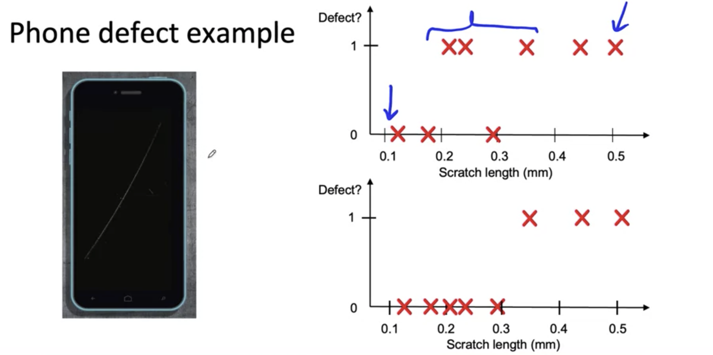
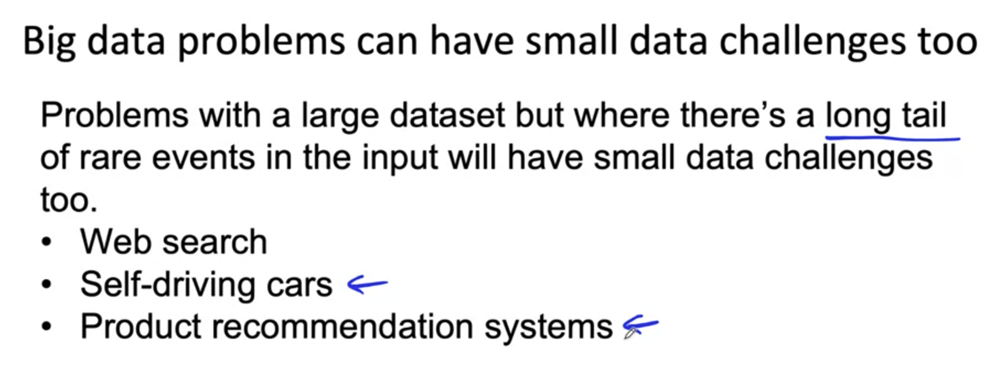

# Define Data and Establish Baseline
## Label data problems
- Unambigious label

Data defintion questions 
- What is the input x?
    - Lighting? Contrast? Resolutin?
    - What features need to be included?
- What is the target label y?
    - How can we ensure labelers give consistent labels?

Major types of data problems
* Unstructured vs structrued data
    - Unstructured data
        - May or may not have huge collection of unlabeled examples x.
        - Humans can label more data.
        - Data augmentation more likely to be helpful.
    - Structrured data
        - May be more difficult to obtain more data.
        - Human labeling may not be possible (with some exceptions)
* Small data vs big data
    - Small data
        - Clean labels are critical
        - Can manually look through dataset and fix labels.
        - Can get all the labelers to talk to each other.
    - Big data
        - Emphasis data process

Why label consistency is important

Improving label consistency
- Have multiple labelers label same example
- When there is disagreement, have MLE, subject matter expert and/or labelers discuss definition of y to reach agreement.
- If labelers believe that x doesn't contain enough information, consider changing x.
- Iterate until it is hard to significantly increase agreement.

- Sometimes we should create a new class for unambigous y.

Human level performance
- In academia, establish and beat a respectable benchmark to support publication.
- Businss or product onwer asks for 99% accuracy. HLP helps establish a more reasonable target.
- "Prove" the ML system is superior to humans doing the job and thus the business or product owner should adopt it.

The problem with beating HLP as a "proof" of ML "superiority"
- "Um... nearest gas station" <- 70% of label
- "Um, nearest gas station" <- 30% of  label
-> Two random labelers agree: 0.7^2 + 0.3^2 = 0.58
- ML agrees with humans: 0.7 -> The 12% better performance is not important for anything! This can also mask more significant eorrs ML may be making.

Raising HLP

- When they label y comes from a human label, HLP << 100% may indicate ambiguous labeling instructions.
- Improving label consitency will raise HLP.
- this makes it harder for ML to beat HLP. but the more consistent labels will raise ML performance, which is ultimately likely to benefit the actual application performance.

HLP on structured data
- Structured data problems are less likely to involve human labelers, thus HLP us less frequently used.

Some exceptions: 
- User ID merging: same person?
- Based on network trafiic, is the computer hacked?
- Is the transaction fraudulent?
- Spam account? Bot?
- From GPS, what is the mode of transporttation - on foot, bike, car, bus?

How long should you spend obtaining data?
- Labeling data
    - Options: In-house vs. outsourced vs. crowdsourced
    - Having MLEs label data is expensive. But doing this for just a few days is usually fine.
    - Who is qualified to label?
        - Speech recognition - any reasonably fluent speaker
        - Factory inspection, medical image diagnosis - SME (subject matter expert)
        - Recommender systems - maybe impossible to label well
    - Don't increase data by more than 10x at a time.

POC and Production phases
- POC (proof of concept):
    - Goal is to decide of the application workable and worth deploying.
    - Focus on getting the prototype to work!
    - It's ok if data pre-processing is manual. But take extensive notes/comments.
- Production phase:
    - After project utility is established, use more sophisticated tools to make sure the data pipeline is replicable.
    - E.g., TensorFlow Transform, Apache Beam, Airflow,...

## Scoping
- Scoping example: Ecommerce retailer looking to increase sales.
    - Better recommender system
    - Better search
    - Improve catalog data
    - Inventory management
    - Price optimization
- Questions:
    - What project should we work on?
    - What are the metrics for success? 
    - What are the resources (data, time, people) needed?

- Scoping process:
    - What are the top 3 things you wish ware working better?
        - Increase conversion
        - Reduce inventory
        - Increase margin (profit per item)
    1. Brainstorm business problems (understanding business problem, not an AI problem)
        
    2. Brainstorm AI solutions
    3. Asses the feasibility and avalue of potential solutions
    4. Determine milestone
    5. Budget for resources

Why use HLP to benchmark?

- People are very good on unstructured data tasks
- Criteria: Can a human, given the same data, perform the task?

Do we have features that are predictive?
- Given past purchases, predict future purchases
- Given weather, predict shopping mall foot traffic
- Given DNA info, predict heart disease? (very hard)
- Given social media chatter, predict demand for clothing style? (very hard).
- Given history of a stock's preice, predict future price of that stock? (impossible or exceedingly difficult)

Diligence on value
- MLE metrics
- Business metrics

Etheical considerations 
- Is this project creating net positive societal value?
- Is this project reasonably fair and free from bias?
- Have any ethical concerns been openly aired and debated?

Milesontes and resourcing
- Key specifications:
    - ML metrics (accuracy, presision/recall, etc)
    - Software metrics (latency, throughput, etc. given compute reousces)
    - Business metrics (revenue, etc.)
    - Resouces needed (data, personnel, help from other teams)
    - Timeline

if unsure, consider benchmarking to other projects, or building a POC (Proof of Concept) first.
Practice: C1W3_Data_Labeling_Ungraded_Lab.ipynb